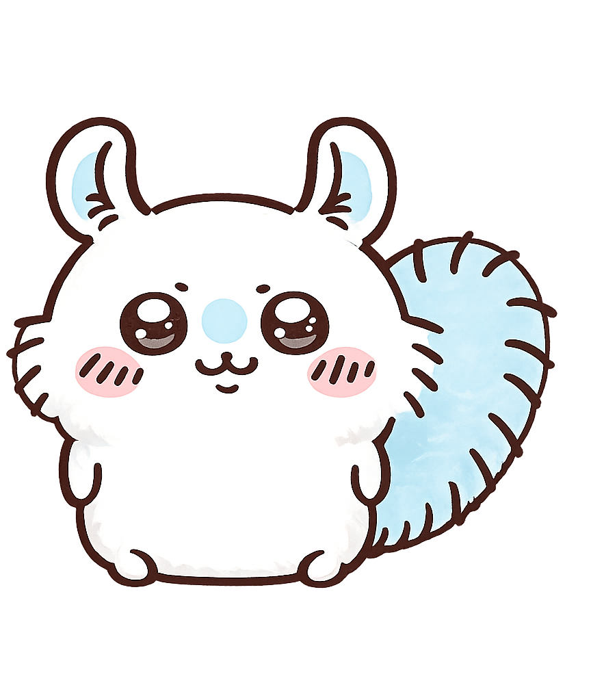
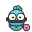

<p align="center">
  
</p>

<h1 align="center">Kuro Desktop Pet (쿠로 데스크탑 펫)</h1>

<p align="center">
  <strong>바탕화면에서 둥둥 떠다니며 집사와 함께 코딩하고 소통하는 귀여운 5종 데스크탑 펫 패밀리.</strong>
</p>

<p align="center">
  <a href="README.md">English</a> · <a href="README.ko.md">한국어</a>
</p>

<p align="center">
  
  
  
  
</p>

---

## 📖 개요 (Overview)

**Kuro Desktop Pet**은 **Electron 33+** 및 **Node.js**를 기반으로 가볍고 부드럽게 동작하는 데스크탑 인터랙티브 동반자 펫입니다. 마우스를 따라 실시간으로 눈동자가 회전하는 시선 추적, 모찌 떡처럼 늘어나는 쫀득한 드래그 물리 엔진, 로컬 저장형 Gemini 1.5 Flash AI 챗봇 말풍선, 글로벌 키보드 입력 감지 앞발 뚱땅거리기, 그리고 **Claude Code**나 **Antigravity**와 같은 AI 코딩 에이전트 구동 시 실시간으로 반응하는 로컬 HTTP 웹훅(Port 18900)을 제공합니다.

---

## 🎭 펫 패밀리 라인업 (The Pet Family)

설정 창(⚙️)의 캐릭터 탭에서 총 9가지의 개성 넘치는 캐릭터를 선택해 바탕화면에 띄워둘 수 있습니다. 각 펫은 고유의 시선 처리, 모션, 그리고 인공지능 대화 성격을 가지고 있습니다.

<p align="center">
  
  
  
  
  
  
  
  
  
</p>

1. **🐱 블랙냥 (BlackYang)**: 이 프로젝트의 트레이드마크인 검정 아기 고양이. 살랑살랑 꼬리를 흔들며, 집사에게 `~냥/~냥냥🐾` 체로 귀엽게 응답합니다.
2. **🧀 치즈냥 (CheeseYang)**: 머리를 위아래로 까닥거리며 키보드 타자 소리에 맞춰 흥겹게 발을 구르는 오렌지 줄무늬 고양이.
3. **🦝 너구리 (Raccoon)**: 집사가 타자를 치는 순간 무서운 속도로 노트북을 꺼내 앞발을 뚱땅거리며 코딩에 동참하는 말썽꾸러기 너구리.
4. **🐙 클라우드 (Clawd)**: 데스크탑 공중을 둥둥 떠다니는 다정한 주황색 산호 문어. 눈을 깜빡이며 간결하고 다정한 대답을 건넵니다.
5. **👨‍🦳 오야지치 (OyaJiChi)**: 콧수염을 기른 엉뚱한 대머리 동네 삼촌. 약간의 투덜거림과 함께 정감 넘치는 유쾌한 아저씨 말투를 씁니다.
6. **🐿️ 모몽가 (Momongga)**: *치이카와*에 나오는 귀엽고 심술쟁이인 흰 날다람쥐. 칭찬과 애정을 듬뿍 받길 좋아하는 어리광쟁이 성격입니다.
7. **👦 맹구 (Maenggu)**: *짱구는 못말려*의 콧물을 흘리는 조용하고 엉뚱한 소년. 돌멩이 수집을 광적으로 좋아하는 성격입니다.
8. **🟢 빵빵이 (Bbangbbang)**: 초록색 셔츠를 입은 웹툰 *빵빵이의 일상* 주인공. 유쾌하고 엽기적이며 깜짝 놀랄 만큼 시끄럽고 장난기 넘칩니다!
9. **🐟 한교동 (Hangyodon)**: 산리오의 감수성 풍부하고 외로움을 타는 파란 물고기 요괴. 단짝인 분홍 문어 사유리와 항상 함께 다닙니다.

---

## ✨ 핵심 기능 (Features)

- **👀 마우스 시선 추적**: 마우스 포인터의 위치를 60FPS로 추적하여 펫의 검은 눈동자가 실시간으로 부드럽게 마우스를 응시합니다.
- **🧬 쫀득한 모찌 드래그**: 펫을 쥐고 흔들면 속도와 원심력에 반응하여 펫 몸통이 길게 늘어나거나 납작하게 찌그러지며, 마우스를 떼면 용수철 탄성과 함께 원래 크기로 복원됩니다.
- **⌨️ 글로벌 입력 감지**: 키보드 입력이 시작되면 펫이 즉각 앞발을 뻗어 타자 모션(`typing` 애니메이션)을 취합니다.
- **💬 원클릭 AI 챗봇**: 펫에 마우스를 대면 뜨는 💬 아이콘을 한 번 누르면 우측 하단에 고급 다크 글래스모피즘 챗 패널이 열려, Gemini AI와 실시간 타자기 효과 대화를 나눌 수 있습니다.
- **⚙️ 다기능 설정 대시보드**: 펫 종류 변경, 사이즈 조절(S/M/L), 마우스 따라오기, 자동 잠자기, Gemini API Key 발급받기 링크, 로컬 SQLite3 DB 경로 확인 및 배포 업데이트 관리.
- **⚡ AI 에이전트 동기화**: 로컬 HTTP 훅을 통해 AI 코딩 툴(`claude`, Antigravity 등)이 실행될 때 펫이 실시간으로 생각(`thinking`)하거나 코딩(`typing`)하는 상태로 자동 연동됩니다.
- **🎁 상호작용 이스터에그**:
  - **3연타 클릭**: 펫을 3번 빠르게 톡-톡-톡 치면 하트가 쏟아지며 춤을 춥니다.
  - **마우스 우클릭**: 펫을 우클릭하면 울상 짓는 찡그린 표정(`sad` 상태)을 3초간 짓습니다.

---

## 🚀 시작하기 (Getting Started)

### 요구 사항
- **Node.js** v20 이상 버전 설치 필수.
- C++ 네이티브 바이너리(`uiohook-napi`, `sqlite3` 등)를 컴파일하기 위해 Windows 빌드 도구(Build Tools)가 로컬에 마련되어 있어야 합니다.

### 설치 및 로컬 실행 방법
저장소를 복제하고, 의존성을 내려받아 런타임을 구동합니다.

```bash
# 1. 저장소 클론
git clone https://github.com/YimJunsu/desktop-pets-Kura.git
cd desktop-pets-Kura

# 2. 패키지 의존성 설치
npm install

# 3. 개발 실행
npm start
```

---

## 📦 업데이트 배포 및 패키징

GitHub Releases에 설치 바이너리를 컴파일 배포하거나, 로컬에서 배포판을 빌드하는 상세 가이드는 [RELEASE.md](RELEASE.md)를 참고하세요.

```bash
# 로컬 빌드 (.exe 생성)
npm run dist

# GitHub Releases 배포 발행
npm run publish
```

---

## 📄 라이선스 (License)

본 프로젝트는 **MIT License**에 의거하여 배포됩니다. 소스 코드를 자유롭게 커스텀하고 활용해 보세요!
