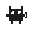
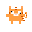
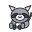
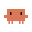

<p align="center">
  
</p>

<h1 align="center">Kuro Desktop Pet</h1>

<p align="center">
  <strong>An interactive multi-mascot desktop pet family that floats and codes alongside you.</strong>
</p>

<p align="center">
  <a href="README.md">English</a> · <a href="README.ko.md">한국어</a>
</p>

<p align="center">
  
  
  
  
</p>

---

## 📖 Overview

**Kuro Desktop Pet** is a lightweight, responsive desktop companion built on **Electron 33+** and **Node.js**. It features high-performance mouse-tracking eyes, squishy mochi-stretch physics, an integrated local Gemini 1.5 Flash AI chatbot, global keyboard typing detection, and real-time coding integrations with agents like **Claude Code** and **Claude Desktop** (via local HTTP webhooks). 

---

## 🎭 The Pet Family

Meet the five unique mascots available inside the control dashboard (⚙️). Each pet has a distinct appearance and automated chatbot personality.

<p align="center">
  
  
  
  
  
</p>

1. **🐱 BlackYang (Kuro-chan)**: Our signature chibi black cat. Loves to wag its tail, and responds with cute cat slangs (`~nyan nyange🐾`).
2. **🧀 CheeseYang (Tabby)**: A vibrant orange tabby cat that bobs its head and dances to the beat of your keyboard typing.
3. **🦝 Raccoon (Kun)**: A mischievous critter that frantically bangs on a keyboard whenever you start typing in any program.
4. **🐙 Clawd (Octopus)**: A friendly orange coral octopus that floats calmly, blinking and providing concise, positive coding responses.
5. **👨‍🦳 OyaJiChi (Uncle)**: A funny, slightly grumbling middle-aged uncle with a bald head and thin mustache. Responds with dry, humorous uncle jokes.

---

## ✨ Features

- **👀 Cursor Tracking**: Realistic vector-mapped pupils that follow your mouse cursor smoothly.
- **🧬 Squishy Mochi Physics**: Grab your pet and swing them around. The body stretches, skews, and compresses, then bounces back with spring physics.
- **⌨️ Global Input Hooking**: Features a low-level native keyboard listener. Mascots start tapping their tiny paws or typing along when you type.
- **💬 One-Click AI Chatbot**: Hover over the pet, click the 💬 icon once, and a floating glassmorphic dialogue panel opens up. Chat in real time with Google's Gemini Flash.
- **⚙️ 4-Tab Settings Panel**: Adjust pet selection, sizing (S/M/L), toggle follow/sleep modes, customize API credentials, check local SQLite database paths, and manage updates.
- **⚡ AI Agent Hooks**: Listens on port `18900`. When you run CLI developers like `claude` (Claude Code) or Antigravity, the pet enters thinking/typing loops alongside your prompt.
- **🎁 Easter Eggs**: 
  - **Triple-click**: Rapidly click the pet 3 times to trigger a heart-bursting happy dance.
  - **Right-click**: Right-click the pet body to make it cry/grizzle (`sad` state) for 3 seconds.

---

## 🚀 Getting Started

### Prerequisites
- **Node.js** v20 or higher.
- Native build components (`uiohook-napi` and `sqlite3` binaries) require C++ Build Tools installed on your computer.

### Installation
Clone the repository, install dependencies, and launch the Electron runtime:

```bash
# 1. Clone repository
git clone https://github.com/YimJunsu/desktop-pets-Kura.git
cd desktop-pets-Kura

# 2. Install dependencies
npm install

# 3. Start development server
npm start
```

---

## 📦 Auto Update & Packaging

Refer to the complete [RELEASE.md](RELEASE.md) for compiling draft releases, managing environment variables (`GH_TOKEN`), and distributing packages via GitHub Releases.

```bash
# Run local build
npm run dist

# Publish to GitHub Releases
npm run publish
```

---

## 📄 License

This project is licensed under the **MIT License**. Feel free to fork, customize, and share!
