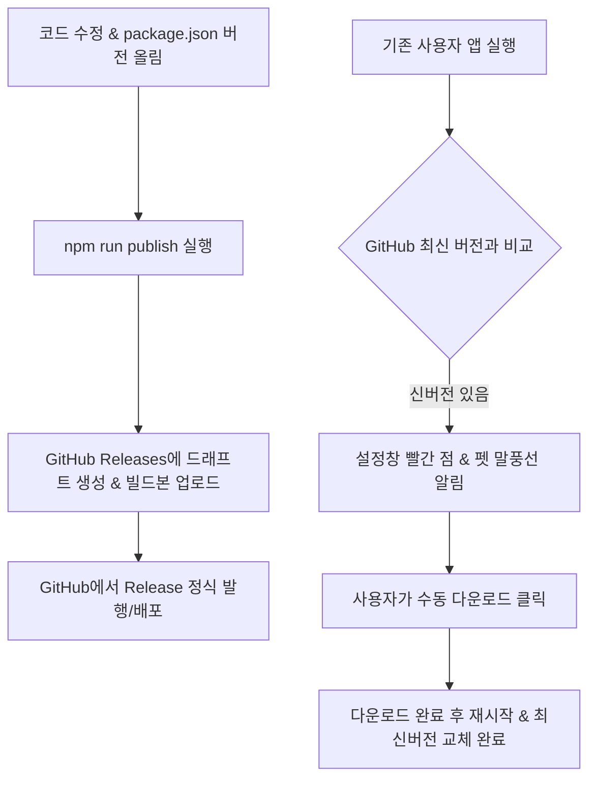

# Kuro Desktop Pet 배포 및 릴리스 가이드 (Release Guide)

이 문서는 **Kuro Desktop Pet**의 버전 관리, 패키징 빌드, 그리고 GitHub Releases를 통한 자동 업데이트(Auto-Updater) 배포 과정을 설명합니다.

---

## 1. 개요 및 동작 원리

이 애플리케이션은 `electron-builder`와 `electron-updater`를 결합하여 자동 업데이트를 처리합니다.



* **버전 정보 피드**: 빌드 시 `latest.yml` 파일이 생성되며, 여기에 최신 버전명, 파일 크기, 해시 블록맵 정보가 저장됩니다.
* **업데이트 확인**: 클라이언트 앱은 백그라운드에서 GitHub Repository의 최신 Releases에 있는 `latest.yml` 파일을 대조하여 버전을 검사합니다.

---

## 2. 사전 준비 사항 (GitHub 연동 설정)

배포용 실행 파일을 GitHub Releases에 자동으로 업로드하기 위해서는 **GitHub Personal Access Token (PAT)**이 필요합니다.

### 2.1 GitHub 토큰 발급
1. [GitHub Settings > Developer Settings > Personal access tokens > Tokens (classic)](https://github.com/settings/tokens)으로 이동합니다.
2. **Generate new token (classic)**을 클릭합니다.
3. 권한(Scope) 설정에서 **`repo`** (public_repo 또는 private인 경우 전체 repo) 항목을 체크합니다.
4. 토큰을 생성하고 안전한 곳에 복사해 둡니다. (창을 닫으면 다시 볼 수 없습니다.)

### 2.2 로컬 개발 환경 변수 설정
`electron-builder`는 환경 변수 `GH_TOKEN`을 참조하여 GitHub에 릴리스를 업로드합니다.

* **Windows (PowerShell)**:
  ```powershell
  $env:GH_TOKEN="your_github_token_here"
  ```
* **Windows (CMD)**:
  ```cmd
  set GH_TOKEN=your_github_token_here
  ```

---

## 3. 배포 및 릴리스 절차 (Step-by-Step)

새로운 기능 추가나 버그 수정을 완료한 후 배포하는 단계입니다.

### Step 1. 버전 변경 (`package.json`)
새 릴리스의 목적에 맞춰 `package.json`의 `"version"` 필드를 수정합니다. (Semantic Versioning 규칙 준수)
* 예: `1.0.0` -> `1.0.1` (패치/버그수정)
* 예: `1.0.0` -> `1.1.0` (기능 추가)

### Step 2. GitHub 토큰 환경 변수 주입
릴리스를 올리기 전 터미널에 토큰을 설정합니다.
```powershell
$env:GH_TOKEN="발급받은_토큰값"
```

### Step 3. 퍼블리시 명령 실행
다음 명령어를 터미널에서 실행하여 자동 패키징 및 GitHub 업로드를 진행합니다.
```bash
npm run publish
```
* 이 명령어는 내부적으로 `electron-builder --publish always`를 실행합니다.
* 빌드가 완료되면 `dist/` 폴더에 설치 파일(`Kuro Desktop Pet Setup X.X.X.exe`)이 생성되고, 동시에 설정된 GitHub 리포지토리의 Releases에 **Draft(초안) 릴리스**가 자동으로 생성되며 바이너리가 업로드됩니다.

### Step 4. GitHub Releases 발행
1. 설정된 GitHub 저장소의 **Releases** 페이지로 이동합니다.
2. 방금 올린 버전에 해당하는 드래프트 릴리스를 선택하고 **Edit**을 클릭합니다.
3. 업데이트 노트(설명)를 작성한 뒤 **Publish release** 버튼을 클릭하여 정식 릴리스로 전환합니다.
   > [!IMPORTANT]
   > 릴리스 상태가 Draft(초안)인 경우 클라이언트 앱의 오토 업데이터가 감지하지 못합니다. 반드시 **Publish**를 눌러 전체 공개 릴리스로 전환해야 업데이트가 적용됩니다.

---

## 4. 유용한 명령어 및 팁

### 4.1 개발자용 명령 모음
| 명령어 | 용도 | 설명 |
| :--- | :--- | :--- |
| `npm start` | **로컬 디버그 실행** | 개발 환경에서 펫을 띄우고 실시간 로그를 확인합니다. |
| `npm run dist` | **로컬 패키징 빌드** | GitHub 업로드 없이 로컬 `dist/` 폴더에 배포 테스트용 설치 본을 생성합니다. |
| `npm run publish` | **GitHub 릴리스 배포** | 빌드 후 즉시 GitHub Releases 드래프트로 파일을 발행합니다. |

### 4.2 주의사항 및 팁
> [!TIP]
> **네이티브 빌드 건너뛰기 (`npmRebuild: false`)**
> 이 프로젝트의 SQLite3 및 uiohook 모듈은 ABI가 안정적인 N-API 기반입니다. `package.json`에 `npmRebuild: false`가 설정되어 있어 Visual Studio C++ 툴체인이 없는 PC에서도 패키징이 에러 없이 깔끔히 진행됩니다.
>
> **로컬 데이터 보존**
> 사용자의 설정값, API Key 및 대화 내용은 로컬 SQLite 데이터베이스 파일(`AppData/Roaming/kuro-pet/settings.db`)에 영구 보존되므로, 사용자가 업데이트를 진행하더라도 데이터가 초기화되지 않습니다.
